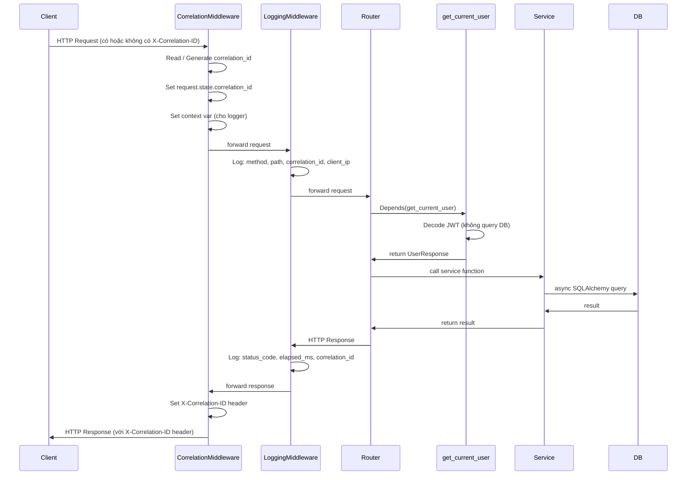
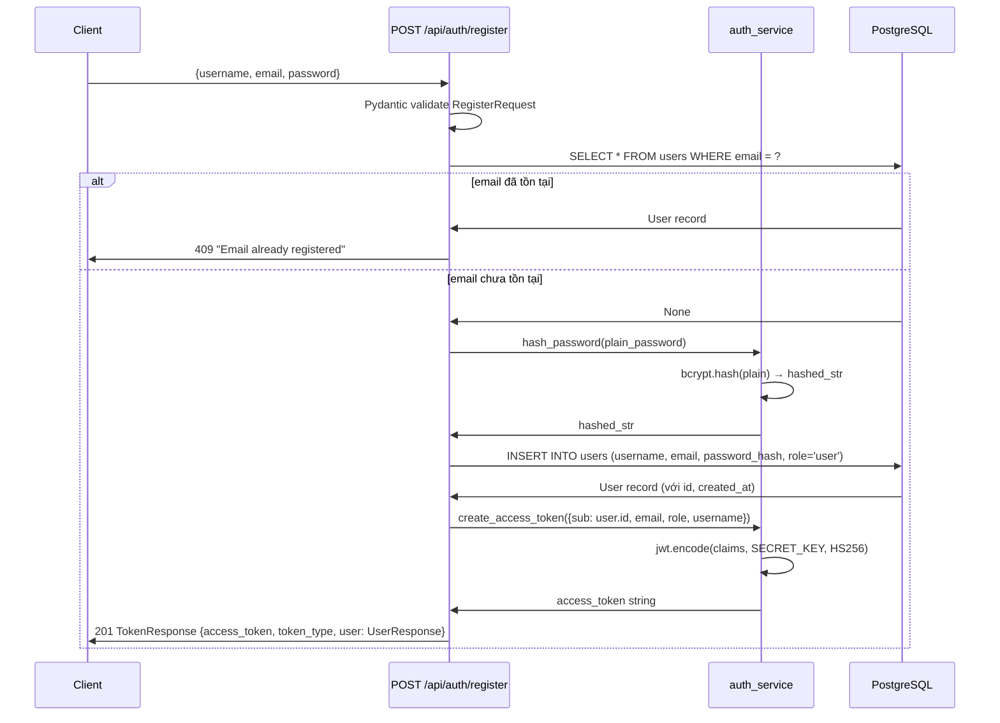
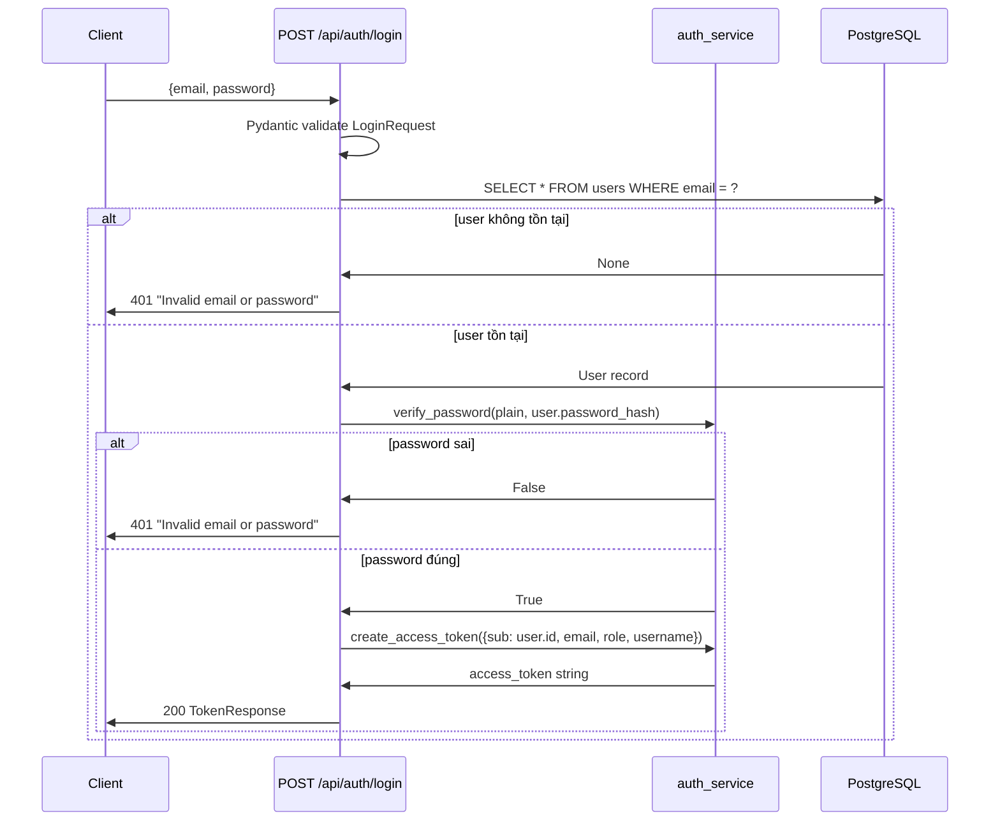
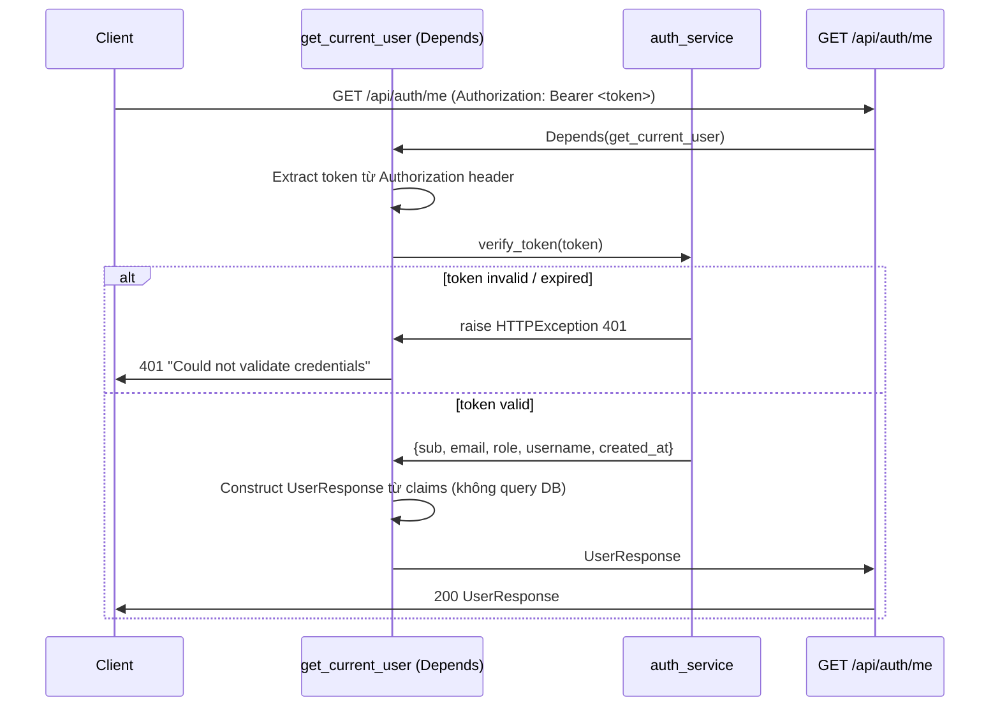

# Design Document — Spec 2: Backend Foundation

> SecondBrain — Robolinks Knowledge Hub
> Tác giả: Kiro AI
> Phụ thuộc: Spec 1 (Infrastructure Setup) phải hoàn thành trước
> Trạng thái: Draft

---

## Overview

Backend Foundation xây dựng toàn bộ "skeleton" của orchestrator FastAPI tại port 8000.
Đây là layer trung tâm mà tất cả spec sau (NAS Connector, Chat API, Wiki, MCP) đều build on top.

Spec này bao gồm:
- FastAPI app entry point với middleware stack hoàn chỉnh
- Configuration management (Pydantic Settings)
- Async SQLAlchemy engine + session factory
- Structured logging → Seq với correlation_id
- 3 ASGI middlewares: CorrelationMiddleware, LoggingMiddleware, RateLimitMiddleware
- FastAPI Depends cho auth và service injection
- 5 SQLAlchemy ORM models (users, conversations, messages, nas_files, nas_folders)
- Alembic async migrations
- Pydantic V2 schemas cho auth
- Auth service (JWT + bcrypt)
- Auth router (register, login, /me)
- Unit test suite + shared conftest fixtures

**Tech stack:**
- Python FastAPI (async) — port 8000
- SQLAlchemy 2.x async + asyncpg driver
- Pydantic V2 + pydantic-settings
- Alembic migrations (async mode)
- python-jose (JWT), passlib[bcrypt] (passwords)
- structlog → Seq HTTP ingestion (port 5341)
- Redis sliding window rate limiting
- PostgreSQL 18 + pgvector (port 5432)


---

## Architecture

### Layered Architecture Overview

```
┌──────────────────────────────────────────────────────────────────────┐
│                        HTTP Request                                   │
└──────────────────────────────┬───────────────────────────────────────┘
                               │
┌──────────────────────────────▼───────────────────────────────────────┐
│                   ASGI Middleware Stack                               │
│  1. CorrelationMiddleware   → inject / propagate X-Correlation-ID     │
│  2. LoggingMiddleware       → log request + response tự động          │
│  3. RateLimitMiddleware     → enforce 100 req/min/token cho /mcp      │
│  4. CORSMiddleware (built-in) → allow http://localhost:3000           │
└──────────────────────────────┬───────────────────────────────────────┘
                               │
┌──────────────────────────────▼───────────────────────────────────────┐
│                         Routers                                       │
│  /api/auth   → auth.py                                               │
│  /mcp        → FastMCP ASGI app mount                                │
│  /health     → inline health check                                   │
│  (future: /api/chat, /api/wiki, /api/admin/*)                        │
└───────────┬─────────────────────────────────────────────────────────┘
            │ FastAPI Depends
┌───────────▼──────────────────────────────────────────────────────────┐
│                     Dependencies Layer                                │
│  dependencies/auth.py     → get_current_user, require_admin          │
│  dependencies/services.py → get_lightrag_query_client,               │
│                              get_lightrag_ingest_client,              │
│                              get_graphiti_client                      │
│  database.py              → get_session (AsyncSession)                │
└───────────┬──────────────────────────────────────────────────────────┘
            │ calls
┌───────────▼──────────────────────────────────────────────────────────┐
│                      Services Layer                                   │
│  services/auth_service.py  → JWT create/verify, bcrypt hash/verify   │
│  (future: conversation_service, wiki_builder, nas_notify)             │
└───────────┬──────────────────────────────────────────────────────────┘
            │ queries / ORM
┌───────────▼──────────────────────────────────────────────────────────┐
│                     Models Layer                                      │
│  models/base.py           → DeclarativeBase                          │
│  models/user.py           → User ORM model                           │
│  models/conversation.py   → Conversation + Message ORM models        │
│  models/nas_file.py       → NasFile ORM model                        │
│  models/nas_folder.py     → NasFolder ORM model                      │
└───────────┬──────────────────────────────────────────────────────────┘
            │ async engine
┌───────────▼──────────────────────────────────────────────────────────┐
│               PostgreSQL 18 + pgvector  (port 5432)                  │
└──────────────────────────────────────────────────────────────────────┘
```


### Sequence: Request Flow với Correlation ID



---

## Components and Interfaces

### `backend/main.py` — FastAPI Application Entry Point

**Responsibility:** Khởi tạo FastAPI app, đăng ký middleware theo thứ tự đúng,
mount routers, mount MCP ASGI app, định nghĩa lifespan context manager.

**Key imports:**
```python
from fastapi import FastAPI
from fastapi.middleware.cors import CORSMiddleware
from contextlib import asynccontextmanager
from backend.middleware.correlation import CorrelationMiddleware
from backend.middleware.logging import LoggingMiddleware
from backend.middleware.rate_limit import RateLimitMiddleware
from backend.routers import auth
from backend.config import settings
from backend.logger import logger
```

**Public interface:**
```python
@asynccontextmanager
async def lifespan(app: FastAPI) -> AsyncGenerator:
    """Startup: log app name + port. Shutdown: cleanup."""
    ...

app = FastAPI(title="SecondBrain Backend", lifespan=lifespan)

# Middleware registration order (QUAN TRỌNG — xem phần Middleware Stack Order)
app.add_middleware(CORSMiddleware, allow_origins=settings.CORS_ORIGINS, ...)
app.add_middleware(RateLimitMiddleware)
app.add_middleware(LoggingMiddleware)
app.add_middleware(CorrelationMiddleware)  # ← phải đăng ký CUỐI để chạy ĐẦU TIÊN

app.include_router(auth.router, prefix="/api/auth")
app.mount("/mcp", mcp.get_asgi_app())

@app.get("/health")
async def health_check() -> dict:
    return {"status": "ok"}
```


### `backend/config.py` — Configuration Management

**Responsibility:** Load toàn bộ environment variables và `.env` file vào một `Settings`
singleton. Fail fast tại startup nếu required settings bị thiếu.

**Key imports:**
```python
from pydantic_settings import BaseSettings, SettingsConfigDict
from pydantic import ValidationError
```

**Public interface:**
```python
class Settings(BaseSettings):
    model_config = SettingsConfigDict(env_file=".env", env_file_encoding="utf-8")

    # Database
    DATABASE_URL: str                    # postgresql+asyncpg://...
    REDIS_URL: str                       # redis://redis:6379

    # Auth
    SECRET_KEY: str
    ALGORITHM: str = "HS256"
    ACCESS_TOKEN_EXPIRE_MINUTES: int = 60

    # Services
    LIGHTRAG_URL: str = "http://lightrag:9621"
    GRAPHITI_URL: str = "http://graphiti-service:9622"
    SEQ_URL: str = "http://seq:5341"

    # CORS
    CORS_ORIGINS: list[str] = ["http://localhost:3000"]

    # Rate limiting
    MCP_RATE_LIMIT_PER_MINUTE: int = 100

settings = Settings()   # singleton — import as: from backend.config import settings
```

### `backend/database.py` — Async Database Engine & Session

**Responsibility:** Tạo async SQLAlchemy engine và session factory. Cung cấp
`get_session` generator cho FastAPI Depends.

**Key imports:**
```python
from sqlalchemy.ext.asyncio import create_async_engine, async_sessionmaker, AsyncSession
from backend.config import settings
```

**Public interface:**
```python
engine = create_async_engine(
    settings.DATABASE_URL,
    pool_pre_ping=True,
    echo=False,
)

AsyncSessionLocal = async_sessionmaker(
    engine,
    expire_on_commit=False,
    class_=AsyncSession,
)

async def get_session() -> AsyncGenerator[AsyncSession, None]:
    """FastAPI Depends — yield session, commit or rollback, close."""
    async with AsyncSessionLocal() as session:
        try:
            yield session
            await session.commit()
        except Exception:
            await session.rollback()
            raise
```

### `backend/logger.py` — Structured Logger với Correlation ID

**Responsibility:** Configure structlog (hoặc python-json-logger) để output
structured JSON. Ship logs đến Seq qua HTTP. Include `correlation_id` và `service`
fields trong mọi log entry.

**Key imports:**
```python
import structlog
import logging
from logging.handlers import HTTPHandler
from backend.config import settings
```

**Public interface:**
```python
# Context var — được set bởi CorrelationMiddleware
correlation_id_ctx: contextvars.ContextVar[str] = contextvars.ContextVar(
    "correlation_id", default=""
)

logger = structlog.get_logger()
# Usage: logger.info("message", key=value, correlation_id=cid)
```

Design decision: Dùng `structlog` với `BoundLogger` — khi Seq unreachable,
fall back sang stdout handler, không raise exception.


### `backend/middleware/correlation.py` — Correlation ID Middleware

**Responsibility:** Inject `X-Correlation-ID` vào mọi request/response.
Tạo UUID v4 mới nếu header chưa có. Set `request.state.correlation_id`
và context var để logger dùng.

**Key imports:**
```python
from starlette.middleware.base import BaseHTTPMiddleware
from starlette.requests import Request
import uuid
```

**Public interface:**
```python
class CorrelationMiddleware(BaseHTTPMiddleware):
    async def dispatch(self, request: Request, call_next) -> Response:
        correlation_id = request.headers.get("X-Correlation-ID") or str(uuid.uuid4())
        request.state.correlation_id = correlation_id
        correlation_id_ctx.set(correlation_id)          # context var cho logger
        response = await call_next(request)
        response.headers["X-Correlation-ID"] = correlation_id
        return response
```

### `backend/middleware/logging.py` — Request/Response Logging Middleware

**Responsibility:** Log mọi request (method, path, correlation_id, client_ip) và
response (status_code, elapsed_ms) tự động. Skip `/health` paths để tránh noise.
Log ERROR khi có unhandled exception.

**Key imports:**
```python
from starlette.middleware.base import BaseHTTPMiddleware
import time
from backend.logger import logger
```

**Public interface:**
```python
class LoggingMiddleware(BaseHTTPMiddleware):
    async def dispatch(self, request: Request, call_next) -> Response:
        if request.url.path.startswith("/health"):
            return await call_next(request)
        start = time.perf_counter()
        correlation_id = getattr(request.state, "correlation_id", "")
        logger.info("request", method=..., path=..., correlation_id=..., client_ip=...)
        try:
            response = await call_next(request)
            elapsed_ms = (time.perf_counter() - start) * 1000
            logger.info("response", status_code=..., elapsed_ms=..., correlation_id=...)
            return response
        except Exception as e:
            logger.error("unhandled_exception", error=str(e), correlation_id=...)
            raise
```

### `backend/middleware/rate_limit.py` — Rate Limit Middleware

**Responsibility:** Enforce rate limit `MCP_RATE_LIMIT_PER_MINUTE` requests per
60-second sliding window per Bearer token, chỉ cho paths bắt đầu bằng `/mcp`.
Khi Redis unreachable: allow through + log WARNING.

**Key imports:**
```python
from starlette.middleware.base import BaseHTTPMiddleware
import redis.asyncio as aioredis
from backend.config import settings
from backend.logger import logger
```

**Public interface:**
```python
class RateLimitMiddleware(BaseHTTPMiddleware):
    def __init__(self, app, redis_url: str = settings.REDIS_URL): ...

    async def dispatch(self, request: Request, call_next) -> Response:
        if not request.url.path.startswith("/mcp"):
            return await call_next(request)
        token = self._extract_token(request)    # Bearer token hoặc "anonymous"
        bucket_key = f"rate_limit:mcp:{token}"
        # Sliding window algorithm — xem phần Rate Limiting Design
        ...
```


### `backend/dependencies/auth.py` — Auth Dependencies

**Responsibility:** FastAPI Depends functions cho authentication và authorization.
`get_current_user` decode JWT (không query DB). `require_admin` check role == "admin".

**Key imports:**
```python
from fastapi import Depends, HTTPException, status
from fastapi.security import HTTPBearer, HTTPAuthorizationCredentials
from backend.services import auth_service
from backend.schemas.auth import UserResponse
```

**Public interface:**
```python
bearer_scheme = HTTPBearer()

async def get_current_user(
    credentials: HTTPAuthorizationCredentials = Depends(bearer_scheme),
) -> UserResponse:
    """Decode JWT từ Authorization header. Không query DB."""
    claims = auth_service.verify_token(credentials.credentials)
    return UserResponse(
        id=claims["sub"],
        email=claims["email"],
        role=claims["role"],
        username=claims["username"],
        created_at=claims.get("created_at"),
    )

async def require_admin(
    current_user: UserResponse = Depends(get_current_user),
) -> UserResponse:
    """Extend get_current_user — thêm check role == admin."""
    if current_user.role != "admin":
        raise HTTPException(status_code=403, detail="Admin access required")
    return current_user
```

**Design decision:** `get_current_user` không hit DB vì JWT đã chứa đủ claims
(sub, email, role, username). Tránh 1 DB round-trip mỗi authenticated request.
Trade-off: revoked tokens vẫn valid cho đến khi hết hạn. Acceptable cho scope MVP.

### `backend/dependencies/services.py` — Service Injection Dependencies

**Responsibility:** Provide integration clients qua FastAPI Depends.
Routers không bao giờ import integrations/ trực tiếp — luôn qua DI.

**Key imports:**
```python
from fastapi import Depends
from backend.config import settings
```

**Public interface:**
```python
async def get_lightrag_query_client() -> LightRAGQueryClient:
    """Return LightRAG query integration client."""
    return LightRAGQueryClient(base_url=settings.LIGHTRAG_URL)

async def get_lightrag_ingest_client() -> LightRAGIngestClient:
    return LightRAGIngestClient(base_url=settings.LIGHTRAG_URL)

async def get_graphiti_client() -> GraphitiClient:
    return GraphitiClient(base_url=settings.GRAPHITI_URL)
```

**Design decision:** Clients được instantiate per-request (không tại module import)
để tránh event loop issues với httpx.AsyncClient. Trong các spec sau có thể tối ưu
thành lifespan-scoped clients nếu cần connection pooling.


### `backend/schemas/auth.py` — Auth Pydantic Schemas

**Responsibility:** Pydantic V2 request/response models cho auth endpoints.
KHÔNG chứa SQLAlchemy code.

**Public interface:**
```python
from pydantic import BaseModel, EmailStr, field_validator, ConfigDict
from datetime import datetime

class LoginRequest(BaseModel):
    email: str
    password: str

class RegisterRequest(BaseModel):
    username: str
    email: EmailStr        # validate email format
    password: str

    @field_validator("password")
    @classmethod
    def password_min_length(cls, v: str) -> str:
        if len(v) < 8:
            raise ValueError("Password must be at least 8 characters")
        return v

class UserResponse(BaseModel):
    model_config = ConfigDict(from_attributes=True)
    id: str
    username: str
    email: str
    role: str
    created_at: datetime

class TokenResponse(BaseModel):
    access_token: str
    token_type: str = "bearer"
    user: UserResponse
```

### `backend/services/auth_service.py` — Auth Service

**Responsibility:** Pure business logic cho JWT và bcrypt.
KHÔNG import httpx, fastapi, hoặc ORM modules.

**Public interface:**
```python
from datetime import timedelta, datetime
from python_jose import jwt, JWTError
from passlib.context import CryptContext
from fastapi import HTTPException, status
from backend.config import settings

pwd_context = CryptContext(schemes=["bcrypt"], deprecated="auto")

def create_access_token(
    data: dict,
    expires_delta: timedelta | None = None,
) -> str:
    """Encode JWT với exp claim. Default expiry từ settings."""

def verify_token(token: str) -> dict:
    """Decode JWT. Raise HTTPException 401 nếu invalid/expired."""

def hash_password(plain: str) -> str:
    """Bcrypt hash của plain password."""

def verify_password(plain: str, hashed: str) -> bool:
    """True nếu plain khớp với hashed. False nếu không khớp."""
```

### `backend/routers/auth.py` — Auth Router

**Responsibility:** Thin layer: validate input → call auth_service + DB → return schema.
KHÔNG implement business logic inline.

**Public interface:**
```python
from fastapi import APIRouter, Depends, HTTPException, status
from sqlalchemy.ext.asyncio import AsyncSession
from backend.database import get_session
from backend.dependencies.auth import get_current_user
from backend.schemas.auth import LoginRequest, RegisterRequest, TokenResponse, UserResponse
from backend.services import auth_service

router = APIRouter()

@router.post("/register", response_model=TokenResponse, status_code=201)
async def register(body: RegisterRequest, db: AsyncSession = Depends(get_session)) -> TokenResponse:
    ...

@router.post("/login", response_model=TokenResponse, status_code=200)
async def login(body: LoginRequest, db: AsyncSession = Depends(get_session)) -> TokenResponse:
    ...

@router.get("/me", response_model=UserResponse)
async def me(current_user: UserResponse = Depends(get_current_user)) -> UserResponse:
    return current_user
```


---

## Data Models

### Database Schema (PostgreSQL)

```sql
-- ── Users ─────────────────────────────────────────────────────────────
CREATE TABLE users (
    id            UUID PRIMARY KEY DEFAULT gen_random_uuid(),
    username      TEXT UNIQUE NOT NULL,
    email         TEXT UNIQUE NOT NULL,
    password_hash TEXT NOT NULL,
    role          TEXT NOT NULL DEFAULT 'user'
                  CHECK (role IN ('user', 'admin')),
    created_at    TIMESTAMPTZ NOT NULL DEFAULT now()
);

-- ── Conversations ──────────────────────────────────────────────────────
CREATE TABLE conversations (
    id         UUID PRIMARY KEY DEFAULT gen_random_uuid(),
    user_id    UUID NOT NULL REFERENCES users(id) ON DELETE CASCADE,
    title      TEXT,                    -- auto-generated từ turn đầu tiên
    created_at TIMESTAMPTZ NOT NULL DEFAULT now(),
    updated_at TIMESTAMPTZ NOT NULL DEFAULT now()
);

-- ── Messages ───────────────────────────────────────────────────────────
CREATE TABLE messages (
    id              UUID PRIMARY KEY DEFAULT gen_random_uuid(),
    conversation_id UUID NOT NULL REFERENCES conversations(id) ON DELETE CASCADE,
    role            TEXT NOT NULL CHECK (role IN ('user', 'assistant')),
    content         TEXT NOT NULL,
    citations       JSONB,              -- [{type, file, page, excerpt, entity, relation, target}]
    graphiti_synced BOOLEAN NOT NULL DEFAULT false,
    created_at      TIMESTAMPTZ NOT NULL DEFAULT now()
);

-- ── NAS Files Queue ────────────────────────────────────────────────────
CREATE TABLE nas_files (
    id              UUID PRIMARY KEY DEFAULT gen_random_uuid(),
    nas_path        TEXT NOT NULL,      -- đường dẫn gốc trên NAS
    folder_type     TEXT NOT NULL CHECK (folder_type IN ('auto', 'manual')),
    status          TEXT NOT NULL DEFAULT 'pending'
                    CHECK (status IN (
                        'pending', 'queued', 'indexing',
                        'indexed', 'failed',
                        'pending_review', 'rejected'
                    )),
    file_hash       TEXT,
    lightrag_doc_id TEXT,
    approved_by     UUID REFERENCES users(id),
    approved_at     TIMESTAMPTZ,
    reject_reason   TEXT,
    indexed_at      TIMESTAMPTZ,
    error_msg       TEXT,
    created_at      TIMESTAMPTZ NOT NULL DEFAULT now()
);

-- ── NAS Folders Config ─────────────────────────────────────────────────
CREATE TABLE nas_folders (
    id           UUID PRIMARY KEY DEFAULT gen_random_uuid(),
    path         TEXT UNIQUE NOT NULL,
    folder_type  TEXT NOT NULL CHECK (folder_type IN ('auto', 'manual')),
    is_active    BOOLEAN NOT NULL DEFAULT true,
    last_scanned TIMESTAMPTZ,
    created_at   TIMESTAMPTZ NOT NULL DEFAULT now()
);
```

### ERD (Entity Relationship Diagram)

```
users ──────────────────────────────────────────┐
  id (PK)                                       │
  username (UNIQUE)                             │
  email (UNIQUE)                                │
  password_hash                                 │ approved_by (FK, nullable)
  role: 'user'|'admin'                          │
  created_at                                    │
       │ 1                                      │
       │                                        │
       │ N                                      │
conversations                              nas_files
  id (PK)                                   id (PK)
  user_id (FK → users.id)                   nas_path
  title (nullable)                          folder_type: 'auto'|'manual'
  created_at                                status: (state machine)
  updated_at                                file_hash
       │ 1                                  lightrag_doc_id
       │                                    approved_by ──────────────→ users.id
       │ N                                  approved_at
messages                                    reject_reason
  id (PK)                                   indexed_at
  conversation_id (FK → conversations.id)   error_msg
  role: 'user'|'assistant'                  created_at
  content
  citations (JSONB)                        nas_folders
  graphiti_synced (BOOLEAN)                 id (PK)
  created_at                                path (UNIQUE)
                                            folder_type
                                            is_active
                                            last_scanned
                                            created_at
```

### Citations JSONB Structure

```json
[
  {
    "type": "document",
    "file": "DA-Heineken-2024-electrical-v3.pdf",
    "page": 3,
    "excerpt": "Motor CB-01: Siemens 1LE1 7.5kW..."
  },
  {
    "type": "graph_entity",
    "entity": "Conveyor CB-01",
    "relation": "USES",
    "target": "Motor Siemens 1LE1 7.5kW"
  }
]
```


### SQLAlchemy ORM Models

```python
# backend/models/base.py
from sqlalchemy.orm import DeclarativeBase

class Base(DeclarativeBase):
    pass
```

```python
# backend/models/user.py
from sqlalchemy import String, text
from sqlalchemy.orm import Mapped, mapped_column
from backend.models.base import Base
import uuid
from datetime import datetime

class User(Base):
    __tablename__ = "users"

    id: Mapped[uuid.UUID] = mapped_column(
        primary_key=True, server_default=text("gen_random_uuid()")
    )
    username: Mapped[str] = mapped_column(String, unique=True, nullable=False)
    email: Mapped[str] = mapped_column(String, unique=True, nullable=False)
    password_hash: Mapped[str] = mapped_column(String, nullable=False)
    role: Mapped[str] = mapped_column(String, nullable=False, default="user")
    created_at: Mapped[datetime] = mapped_column(server_default=text("now()"))
```

```python
# backend/models/conversation.py — Conversation + Message
class Conversation(Base):
    __tablename__ = "conversations"
    id: Mapped[uuid.UUID] = ...
    user_id: Mapped[uuid.UUID] = mapped_column(ForeignKey("users.id"))
    title: Mapped[str | None]
    created_at: Mapped[datetime] = ...
    updated_at: Mapped[datetime] = ...
    messages: Mapped[list["Message"]] = relationship(lazy="selectin")

class Message(Base):
    __tablename__ = "messages"
    id: Mapped[uuid.UUID] = ...
    conversation_id: Mapped[uuid.UUID] = mapped_column(ForeignKey("conversations.id"))
    role: Mapped[str]
    content: Mapped[str]
    citations: Mapped[dict | None] = mapped_column(JSONB, nullable=True)
    graphiti_synced: Mapped[bool] = mapped_column(default=False)
    created_at: Mapped[datetime] = ...
```

**Design note — `lazy="selectin"`:**
Dùng `selectin` thay vì `select` để load relationships trong async context.
SQLAlchemy async không hỗ trợ lazy loading mặc định (sẽ raise `MissingGreenlet`).

---

## Middleware Stack Order

FastAPI/Starlette đăng ký middleware theo kiểu **LIFO** (Last In, First Out).
Middleware được `add_middleware` **sau cùng** sẽ **chạy đầu tiên** khi request đến.

```python
# Đăng ký trong main.py — thứ tự này quan trọng
app.add_middleware(CORSMiddleware, ...)        # đăng ký đầu → chạy cuối
app.add_middleware(RateLimitMiddleware)        # đăng ký thứ 2 → chạy thứ 3
app.add_middleware(LoggingMiddleware)          # đăng ký thứ 3 → chạy thứ 2
app.add_middleware(CorrelationMiddleware)      # đăng ký cuối → chạy ĐẦU TIÊN
```

**Thứ tự thực tế khi request đến:**

```
Request → [1] CorrelationMiddleware
               ↓ đã có correlation_id trong request.state
          [2] LoggingMiddleware
               ↓ có thể đọc correlation_id từ request.state
          [3] RateLimitMiddleware
               ↓ chỉ áp dụng cho /mcp
          [4] CORSMiddleware
               ↓
          [5] Router / Handler
               ↑
          [4] CORSMiddleware
               ↑
          [3] RateLimitMiddleware
               ↑
          [2] LoggingMiddleware (log response status + elapsed)
               ↑ correlation_id vẫn available
          [1] CorrelationMiddleware (set X-Correlation-ID header)
Response ←
```

**Tại sao thứ tự này quan trọng:**
- `CorrelationMiddleware` PHẢI chạy đầu tiên vì `LoggingMiddleware` cần đọc
  `request.state.correlation_id` và context var để include trong log.
- Nếu đảo thứ tự: `LoggingMiddleware` chạy trước → `correlation_id` chưa được set
  → log thiếu correlation_id → mất khả năng trace request trên Seq.
- `RateLimitMiddleware` chạy sau Logging để rate-limited requests vẫn được log.


---

## Auth Flow

### Register Flow



### Login Flow



**Security note:** Register và Login đều trả cùng message "Invalid email or password"
cho cả 2 trường hợp (user không tồn tại VÀ password sai). Điều này ngăn **user enumeration attack** —
attacker không biết được email nào đã đăng ký.

### GET /me Flow




---

## Dependency Injection Design

FastAPI's DI system cho phép swap implementations tại test time thông qua
`app.dependency_overrides`. Design này là chìa khóa để unit test không cần
DB thật hay external services.

### Dependency Graph

```
Router handler
├── Depends(get_session)               → AsyncSession
│     └── database.py:AsyncSessionLocal
│
├── Depends(get_current_user)          → UserResponse
│     └── auth_service.verify_token()
│           └── settings.SECRET_KEY
│
├── Depends(require_admin)             → UserResponse
│     └── Depends(get_current_user)
│
├── Depends(get_lightrag_query_client) → LightRAGQueryClient
│     └── settings.LIGHTRAG_URL
│
├── Depends(get_lightrag_ingest_client) → LightRAGIngestClient
│     └── settings.LIGHTRAG_URL
│
└── Depends(get_graphiti_client)       → GraphitiClient
      └── settings.GRAPHITI_URL
```

### Test Time Override Pattern

```python
# tests/conftest.py
from fastapi.testclient import TestClient
from backend.main import app
from backend.dependencies.auth import get_current_user

@pytest.fixture
def client(fake_user):
    app.dependency_overrides[get_current_user] = lambda: fake_user
    with TestClient(app) as c:
        yield c
    app.dependency_overrides.clear()   # Quan trọng: clean up sau test
```

### get_current_user không query DB

`get_current_user` decode JWT claims trực tiếp mà không hit DB:

```python
# Đúng — chỉ decode JWT
async def get_current_user(credentials = Depends(bearer_scheme)) -> UserResponse:
    claims = auth_service.verify_token(credentials.credentials)
    return UserResponse(**claims)

# Sai — tránh pattern này (làm DB round-trip mỗi request)
async def get_current_user_bad(...) -> User:
    claims = decode_jwt(token)
    user = await db.get(User, claims["sub"])   # ← tránh
    return user
```

**Trade-off được chấp nhận:** Token bị revoke (logout) vẫn valid cho đến khi hết hạn
(`ACCESS_TOKEN_EXPIRE_MINUTES`, default 60 phút). Với scope MVP của Robolinks
(internal tool, ~20 người), đây là acceptable trade-off.

Nếu cần strict revocation trong tương lai: thêm Redis blacklist cho token JTI (JWT ID).

---

## Rate Limiting Design

### Redis Sliding Window Algorithm

Cho mỗi Bearer token (hoặc "anonymous" nếu không có auth):

```
Key: rate_limit:mcp:{token_hash}
Type: Redis Sorted Set (ZSET)
  - Member: request timestamp (nanoseconds)
  - Score: same timestamp

Algorithm per request:
  1. now = current_timestamp_ms
  2. window_start = now - 60_000  (60 giây trước)
  3. ZREMRANGEBYSCORE key 0 window_start   (xóa requests cũ ngoài window)
  4. count = ZCARD key
  5. if count >= MCP_RATE_LIMIT_PER_MINUTE:
       return 429 {"detail": "Rate limit exceeded. Try again in {seconds} seconds."}
  6. ZADD key now now
  7. EXPIRE key 61   (TTL cleanup)
  8. proceed with request
```

```python
async def check_rate_limit(redis_client, token: str, limit: int) -> tuple[bool, int]:
    """
    Returns (is_allowed, retry_after_seconds).
    """
    key = f"rate_limit:mcp:{token}"
    now = int(time.time() * 1000)
    window_start = now - 60_000

    pipe = redis_client.pipeline()
    pipe.zremrangebyscore(key, 0, window_start)
    pipe.zcard(key)
    pipe.zadd(key, {str(now): now})
    pipe.expire(key, 61)
    results = await pipe.execute()

    count = results[1]
    if count >= limit:
        oldest = await redis_client.zrange(key, 0, 0, withscores=True)
        if oldest:
            retry_after = int((oldest[0][1] + 60_000 - now) / 1000) + 1
        else:
            retry_after = 60
        return False, retry_after
    return True, 0
```

### Redis Down Graceful Degradation

```python
try:
    is_allowed, retry_after = await check_rate_limit(self.redis, token, limit)
    if not is_allowed:
        return JSONResponse(status_code=429, content={
            "detail": f"Rate limit exceeded. Try again in {retry_after} seconds."
        })
except redis.RedisError as e:
    logger.warning("Redis unavailable for rate limiting, allowing request",
                   error=str(e), path=request.url.path)
    # Fall through — request được phép khi Redis down
return await call_next(request)
```

**Design decision:** Redis down = allow through + WARNING log.
Rate limiting là best-effort safeguard, không phải security boundary.
Nếu Redis down, legitimate users không bị block. Worst case: brief DoS window
cho đến khi Redis recover — acceptable cho internal tool scope.


---

## Alembic Async Migration Setup

### Directory Structure

```
backend/
└── migrations/
    ├── alembic.ini          ← không chứa DATABASE_URL plaintext
    ├── env.py               ← async migration setup
    └── versions/
        └── 001_initial_schema.py   ← tạo 5 tables
```

### `env.py` Pattern (Async SQLAlchemy)

```python
# backend/migrations/env.py
import asyncio
from logging.config import fileConfig
from sqlalchemy.ext.asyncio import create_async_engine
from alembic import context

# Import tất cả models để Alembic biết metadata
from backend.config import settings
from backend.models.base import Base
from backend.models.user import User
from backend.models.conversation import Conversation, Message
from backend.models.nas_file import NasFile
from backend.models.nas_folder import NasFolder

config = context.config
target_metadata = Base.metadata

def run_migrations_offline() -> None:
    """Offline mode — generate SQL script."""
    context.configure(
        url=settings.DATABASE_URL,
        target_metadata=target_metadata,
        literal_binds=True,
        dialect_opts={"paramstyle": "named"},
    )
    with context.begin_transaction():
        context.run_migrations()

async def run_migrations_online() -> None:
    """Online mode — apply migrations to DB."""
    connectable = create_async_engine(settings.DATABASE_URL)
    async with connectable.connect() as connection:
        await connection.run_sync(do_run_migrations)
    await connectable.dispose()

def do_run_migrations(connection):
    context.configure(connection=connection, target_metadata=target_metadata)
    with context.begin_transaction():
        context.run_migrations()

if context.is_offline_mode():
    run_migrations_offline()
else:
    asyncio.run(run_migrations_online())
```

### `alembic.ini` — Không có DATABASE_URL

```ini
[alembic]
# script_location trỏ đến thư mục migrations
script_location = backend/migrations

# sqlalchemy.url để TRỐNG — env.py đọc từ settings
# sqlalchemy.url =

[loggers]
keys = root,sqlalchemy,alembic
```

**Design decision:** `alembic.ini` không bao giờ chứa connection string. Tất cả
connection settings đi qua `backend/config.py` → `settings.DATABASE_URL`.
Điều này đảm bảo không có credentials nào hardcode trong source code.

### Chạy migrations

```bash
# Upgrade lên phiên bản mới nhất
cd /app && alembic upgrade head

# Rollback 1 phiên bản
alembic downgrade -1

# Generate migration mới
alembic revision --autogenerate -m "add_index_to_messages"
```

---

## Correctness Properties

*A property is a characteristic or behavior that should hold true across all valid
executions of a system — essentially, a formal statement about what the system
should do. Properties serve as the bridge between human-readable specifications
and machine-verifiable correctness guarantees.*

### Property 1: Correlation ID Invariant

*For any* HTTP request sent to any endpoint, whether or not the request includes an
`X-Correlation-ID` header, the response SHALL always contain an `X-Correlation-ID`
header. When the request provides a correlation ID, the response SHALL echo the
same value. When the request provides no correlation ID, the response SHALL contain
a newly generated, unique value that differs from other requests.

**Validates: Requirements 5.2, 5.3, 5.4, 5.5, 5.7**

### Property 2: JWT Claims Round-Trip

*For any* dictionary of claims containing at least `sub`, `email`, and `role` fields,
calling `create_access_token(claims)` followed immediately by `verify_token(token)`
SHALL return a dictionary containing the same `sub`, `email`, and `role` values as
the original claims.

**Validates: Requirements 15.2, 15.3, 17.9**

### Property 3: Bcrypt Round-Trip

*For any* non-empty plain text password string, calling `hash_password(plain)`
followed by `verify_password(plain, hashed)` SHALL return `True`. Calling
`verify_password` with a different plain text string and the same hash SHALL
return `False`.

**Validates: Requirements 15.4, 15.5, 17.7, 17.8**

### Property 4: Schema Validation Rejects Invalid Inputs

*For any* password string of length strictly less than 8 characters, constructing a
`RegisterRequest` with that password SHALL raise a `ValidationError`. *For any*
string that does not conform to email address format (RFC 5322), constructing a
`RegisterRequest` with that email SHALL raise a `ValidationError`.

**Validates: Requirements 14.3, 14.7, 17.2, 17.3**

### Property 5: Auth Token Round-Trip

*For any* valid user registration payload (unique email, valid email format, password ≥ 8
characters), the `access_token` returned by `POST /api/auth/register` SHALL be
accepted by `GET /api/auth/me` and SHALL return a `UserResponse` matching the
registered email, username, and role.

**Validates: Requirements 16.7, 20.1, 20.3, 20.7**

### Property 6: Rate Limit Enforcement

*For any* Bearer token value, after exactly `MCP_RATE_LIMIT_PER_MINUTE` requests to
any `/mcp` endpoint within a 60-second window, the next request within that same
window SHALL receive HTTP 429. After the 60-second window expires, requests SHALL
be allowed again up to the limit.

**Validates: Requirements 7.3, 7.4, 7.5**


---

## Error Handling

### HTTP Error Codes và Scenarios

| Scenario | Code | Detail message |
|---|---|---|
| Register với email đã tồn tại | 409 | `"Email already registered"` |
| Login với email/password sai | 401 | `"Invalid email or password"` |
| Request thiếu Authorization header | 401 | `"Could not validate credentials"` |
| JWT expired hoặc invalid signature | 401 | `"Could not validate credentials"` |
| Non-admin user gọi admin endpoint | 403 | `"Admin access required"` |
| DB connection error | 503 | (propagate từ SQLAlchemy) |
| Rate limit exceeded | 429 | `"Rate limit exceeded. Try again in {N} seconds."` |
| LightRAG service error | 502 | `"LightRAG service error"` |
| Request validation failed (Pydantic) | 422 | FastAPI default validation errors |

### Error Handling Strategy

```
Service layer:
  - Raise HTTPException với status code và detail rõ ràng
  - Không expose internal error details (stack trace) cho client

Integration layer (integrations/):
  - Catch httpx.HTTPStatusError → raise HTTPException(502, ...)
  - Catch httpx.TimeoutException → raise HTTPException(504, ...)
  - Log error với correlation_id trước khi raise

Middleware layer:
  - LoggingMiddleware catch Exception → log ERROR + re-raise
  - RateLimitMiddleware Redis error → log WARNING + allow through (không raise)
  - CorrelationMiddleware → không catch exception (let propagate)

Database layer:
  - get_session generator: rollback on exception, let propagate
  - FastAPI returns 500 for unhandled SQLAlchemy errors
  - pool_pre_ping=True: detect stale connections trước khi use
```

### Graceful Degradation Map

| Service Down | Behavior | Impact |
|---|---|---|
| Redis | Rate limit disabled (WARNING log) | /mcp unprotected nhưng functional |
| Seq | Fall back to stdout (no exception) | Logs không centralized nhưng vẫn có |
| PostgreSQL | 503 (từ SQLAlchemy pool timeout) | Auth và DB ops fail |
| LightRAG | 502 (từ httpx timeout/error) | Chat và Wiki fail, Auth vẫn OK |
| Graphiti | Log warning, return `{ok: False}` | Conversation memory không sync, Chat OK |

---

## Testing Strategy

### Test Architecture

Spec 2 dùng 3-tier test strategy như mô tả trong pa3-design Section 15.

#### Tier 1 — Unit Tests (không cần Docker)

Location: `tests/unit/backend/`
Dependencies: `pytest`, `pytest-asyncio`, `fastapi[TestClient]`

| File | Test target | Mock strategy |
|---|---|---|
| `test_schemas.py` | Pydantic V2 schema validation | Không cần mock |
| `test_auth_service.py` | JWT round-trip, bcrypt round-trip, token expiry | Không cần mock |
| `test_middleware.py` | CorrelationMiddleware header behavior | FastAPI TestClient |

**Key patterns:**

```python
# test_schemas.py — schema validation
import pytest
from pydantic import ValidationError
from backend.schemas.auth import RegisterRequest

def test_password_too_short():
    with pytest.raises(ValidationError) as exc_info:
        RegisterRequest(username="user", email="a@b.com", password="short")
    assert "8 characters" in str(exc_info.value)

def test_invalid_email_format():
    with pytest.raises(ValidationError):
        RegisterRequest(username="user", email="not-an-email", password="valid_pass_123")
```

```python
# test_auth_service.py — round-trip properties
from backend.services import auth_service

def test_jwt_round_trip():
    claims = {"sub": "user-123", "email": "a@b.com", "role": "user", "username": "alice"}
    token = auth_service.create_access_token(claims)
    decoded = auth_service.verify_token(token)
    assert decoded["sub"] == claims["sub"]
    assert decoded["email"] == claims["email"]

def test_bcrypt_round_trip():
    plain = "my_secret_password"
    hashed = auth_service.hash_password(plain)
    assert hashed != plain
    assert auth_service.verify_password(plain, hashed) is True
    assert auth_service.verify_password("wrong_pass", hashed) is False
```

```python
# test_middleware.py — correlation ID invariant
from fastapi.testclient import TestClient
from backend.main import app
import uuid

def test_correlation_id_generated_when_absent():
    with TestClient(app) as client:
        response = client.get("/health")
    assert "x-correlation-id" in response.headers
    cid = response.headers["x-correlation-id"]
    assert len(cid) == 36   # UUID v4 format

def test_correlation_id_echoed_when_provided():
    with TestClient(app) as client:
        custom_id = "custom-trace-abc-123"
        response = client.get("/health", headers={"X-Correlation-ID": custom_id})
    assert response.headers["x-correlation-id"] == custom_id
```


#### Tier 2 — Integration Tests (cần PostgreSQL + Redis)

Location: `tests/integration/backend/`
Stack: `docker-compose.test.yml` (postgres + redis, không cần lightrag/graphiti)

```yaml
# tests/docker-compose.test.yml
services:
  postgres:
    image: pgvector/pgvector:pg18
    environment:
      POSTGRES_DB: secondbrain_test
      POSTGRES_USER: test
      POSTGRES_PASSWORD: test
    ports: ["5433:5432"]
  redis:
    image: redis:7-alpine
    ports: ["6380:6379"]
```

| Test | Mô tả |
|---|---|
| `test_models.py` | CRUD User, Conversation, Message, NasFile, NasFolder |
| `test_auth_flow.py` | Register → Login → /me end-to-end với real DB |
| `test_alembic.py` | `alembic upgrade head` + `alembic downgrade -1` không lỗi |

```bash
# Chạy integration tests
docker compose -f tests/docker-compose.test.yml up -d
pytest tests/integration/backend/ -v
docker compose -f tests/docker-compose.test.yml down
```

#### Shared Fixtures — `tests/conftest.py`

```python
import pytest
from fastapi.testclient import TestClient
from unittest.mock import AsyncMock
from backend.main import app
from backend.dependencies.auth import get_current_user

@pytest.fixture
def fake_user():
    return {"id": "test-user-id", "email": "test@robolinks.vn",
            "role": "user", "username": "testuser",
            "created_at": "2026-01-01T00:00:00"}

@pytest.fixture
def fake_admin():
    return {"id": "admin-id", "email": "admin@robolinks.vn",
            "role": "admin", "username": "admin",
            "created_at": "2026-01-01T00:00:00"}

@pytest.fixture
def client(fake_user):
    app.dependency_overrides[get_current_user] = lambda: fake_user
    with TestClient(app) as c:
        yield c
    app.dependency_overrides.clear()    # Tránh state leakage

@pytest.fixture
def admin_client(fake_admin):
    app.dependency_overrides[get_current_user] = lambda: fake_admin
    with TestClient(app) as c:
        yield c
    app.dependency_overrides.clear()

@pytest.fixture
def mock_lightrag_query(monkeypatch):
    mock = AsyncMock(return_value={
        "response": "Motor Siemens 1LE1 7.5kW",
        "sources": [{"file": "BOM-Heineken-2024.xlsx"}]
    })
    monkeypatch.setattr("backend.integrations.lightrag.query.query", mock)
    return mock

@pytest.fixture
def mock_graphiti(monkeypatch):
    mock = AsyncMock(return_value={"ok": True})
    monkeypatch.setattr("backend.integrations.graphiti.extract", mock)
    return mock
```

### Property-Based Testing Setup

Spec 2 sử dụng **Hypothesis** cho property-based tests (Python ecosystem):

```python
# requirements-dev.txt
hypothesis==6.112.0    # pin version
pytest-asyncio==0.23.8
```

```python
# tests/unit/backend/test_auth_service_pbt.py
from hypothesis import given, settings as hyp_settings
from hypothesis import strategies as st
from backend.services import auth_service

# Feature: backend-foundation, Property 2: JWT claims round-trip
@given(st.fixed_dictionaries({
    "sub": st.uuids().map(str),
    "email": st.emails(),
    "role": st.sampled_from(["user", "admin"]),
    "username": st.text(min_size=1, max_size=50),
}))
@hyp_settings(max_examples=100)
def test_jwt_round_trip_property(claims):
    token = auth_service.create_access_token(claims)
    decoded = auth_service.verify_token(token)
    assert decoded["sub"] == claims["sub"]
    assert decoded["email"] == claims["email"]
    assert decoded["role"] == claims["role"]

# Feature: backend-foundation, Property 3: Bcrypt round-trip
@given(st.text(min_size=8, max_size=72))  # bcrypt max 72 bytes
@hyp_settings(max_examples=100)
def test_bcrypt_round_trip_property(plain_password):
    hashed = auth_service.hash_password(plain_password)
    assert auth_service.verify_password(plain_password, hashed) is True

# Feature: backend-foundation, Property 4: Schema rejects short passwords
@given(st.text(max_size=7))   # passwords shorter than 8 chars
@hyp_settings(max_examples=100)
def test_short_password_rejected(short_password):
    with pytest.raises(ValidationError):
        RegisterRequest(username="user", email="a@b.com", password=short_password)
```

### Coverage Targets (từ pa3-design Section 15)

| Module | Target coverage |
|---|---|
| `backend/schemas/` | 95%+ |
| `backend/services/auth_service.py` | 95%+ |
| `backend/middleware/correlation.py` | 90%+ |
| `backend/routers/auth.py` | 85%+ |
| `backend/dependencies/auth.py` | 90%+ |


---

## Key Design Decisions

### 1. Tại sao `services/` KHÔNG được import `httpx`

**Rule:** `backend/services/` = business logic thuần. `backend/integrations/` = external HTTP clients.

**Lý do:**
- **Testability:** Service functions có thể được unit-test không cần mock HTTP.
  `auth_service.hash_password()` chỉ cần `passlib` — test instant, không cần network.
- **Separation of concerns:** Service layer không biết LightRAG tồn tại.
  Nếu ta thay LightRAG bằng service khác, chỉ cần update `integrations/` layer,
  không đụng đến `services/`.
- **Dependency injection:** Routers nhận integration clients qua `Depends(get_lightrag_query_client)`.
  Tại test time: `app.dependency_overrides[get_lightrag_query_client] = lambda: MockClient()`.
  Không cần monkeypatch sâu vào service internals.

```python
# Đúng — auth_service.py không biết về HTTP
def verify_token(token: str) -> dict:
    try:
        return jwt.decode(token, settings.SECRET_KEY, algorithms=[settings.ALGORITHM])
    except JWTError:
        raise HTTPException(status_code=401, ...)

# Sai — service tự gọi external service
async def get_user_knowledge(user_id: str) -> dict:
    async with httpx.AsyncClient() as client:  # ← KHÔNG trong services/
        return await client.get(f"{LIGHTRAG_URL}/query")
```

### 2. Tại sao `dependencies/auth.py` KHÔNG hit DB mỗi request

**Design:** `get_current_user` chỉ decode JWT — không SELECT từ DB.

**Lý do:**
- **Performance:** Với ~20 users, không phải problem. Nhưng nguyên tắc đúng: mỗi
  authenticated request không nên tốn 1 DB round-trip chỉ để verify token.
- **JWT self-contained:** JWT chứa đủ claims cần thiết (sub, email, role, username).
  Không cần DB lookup thêm.
- **Async scalability:** Giảm connection pool pressure khi có nhiều concurrent requests.

**Trade-off accepted:** Logout không invalidate token ngay lập tức (token valid đến khi `exp`).
Với internal tool scope và `ACCESS_TOKEN_EXPIRE_MINUTES=60`, đây là acceptable.
Nếu cần strict revocation: thêm Redis JTI blacklist (future enhancement).

### 3. Tại sao `RateLimitMiddleware` fall back khi Redis down

**Design:** Redis unavailable → allow request + WARNING log (không block).

**Lý do:**
- **Availability > Security (cho internal tool):** Rate limiting là DoS protection,
  không phải authentication. Nếu Redis tạm down, việc block legitimate requests
  của kỹ sư Robolinks gây hại nhiều hơn là allow unrated traffic.
- **Graceful degradation:** System vẫn functional khi một dependency fail.
- **Observability:** WARNING log giúp engineer biết Redis đang có vấn đề.
- **Recovery:** Khi Redis recover, rate limiting tự động active lại — không cần restart.

```python
try:
    allowed, retry_after = await check_rate_limit(redis, token, limit)
    if not allowed:
        return JSONResponse(429, ...)
except redis.RedisError:
    logger.warning("Redis down — rate limiting disabled", ...)
    # Fall through, allow request
return await call_next(request)
```

### 4. Tại sao dùng `lazy="selectin"` cho relationship

**SQLAlchemy async không hỗ trợ lazy loading mặc định** (`lazy="select"`).
Nếu dùng `lazy="select"` trong async context, SQLAlchemy raise `MissingGreenlet`.

```python
# Đúng — selectin loading trong async
messages: Mapped[list["Message"]] = relationship(lazy="selectin")

# Sai — sẽ raise MissingGreenlet trong async context
messages: Mapped[list["Message"]] = relationship()  # lazy="select" mặc định
```

`selectin` phát ra 1 câu SELECT riêng biệt để load related objects —
compatible với async execution và dễ predict performance.

### 5. Tại sao `alembic.ini` không chứa DATABASE_URL

**Design:** Connection string đọc từ `settings` (env vars), không hardcode trong file.

**Lý do:**
- **Security:** Credentials không bao giờ nằm trong source code
  (tránh bị commit nhầm lên git).
- **Environment flexibility:** Cùng 1 `alembic.ini` cho dev, staging, production —
  chỉ khác biến môi trường.
- **Consistency:** Mọi nơi trong codebase đều dùng `settings.DATABASE_URL` —
  single source of truth.

---

## Appendix: File Structure Summary

```
backend/
├── main.py                      # FastAPI app, middleware, router mounts
├── config.py                    # Pydantic Settings singleton
├── database.py                  # async engine + get_session Depends
├── logger.py                    # structlog → Seq, correlation_id context var
│
├── middleware/
│   ├── __init__.py
│   ├── correlation.py           # inject/propagate X-Correlation-ID
│   ├── logging.py               # auto-log request/response
│   └── rate_limit.py            # Redis sliding window /mcp endpoints
│
├── dependencies/
│   ├── __init__.py
│   ├── auth.py                  # get_current_user, require_admin
│   └── services.py              # get_lightrag_*, get_graphiti_client
│
├── schemas/
│   └── auth.py                  # LoginRequest, RegisterRequest,
│                                #   TokenResponse, UserResponse
│
├── services/
│   └── auth_service.py          # JWT create/verify, bcrypt hash/verify
│
├── routers/
│   └── auth.py                  # POST /register, /login, GET /me
│
├── models/
│   ├── base.py                  # DeclarativeBase
│   ├── user.py                  # User ORM
│   ├── conversation.py          # Conversation + Message ORM
│   ├── nas_file.py              # NasFile ORM
│   └── nas_folder.py            # NasFolder ORM
│
└── migrations/
    ├── alembic.ini
    ├── env.py                   # async migration setup
    └── versions/
        └── 001_initial_schema.py

tests/
├── conftest.py                  # fake_user, fake_admin, client, mock_lightrag, mock_graphiti
├── unit/
│   └── backend/
│       ├── test_schemas.py
│       ├── test_auth_service.py
│       ├── test_auth_service_pbt.py  # Hypothesis property tests
│       └── test_middleware.py
├── integration/
│   └── backend/
│       ├── test_models.py
│       ├── test_auth_flow.py
│       └── test_alembic.py
└── docker-compose.test.yml      # postgres + redis cho integration tests
```

